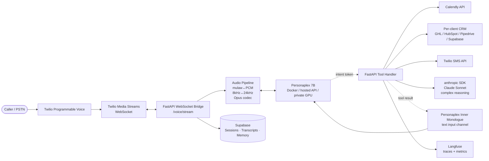

# Personaplex Architecture — Voice Receptionist

The complete build spec for Tier-2 Voice Receptionist on the NVIDIA Personaplex 7B voice model. Reference shapes only — actual Python is written when the build begins.

Cross-references:
- [`tech-stack-research.md`](tech-stack-research.md) — overview + stack rationale
- [`../shared-knowledge/agent-infrastructure.md`](../shared-knowledge/agent-infrastructure.md) — the four primitives this product inherits
- [`../../../anthony-rosa/north-star.md`](../../../anthony-rosa/north-star.md) — founder-layer rationale, including the Greg Osuri / Akash thesis that scopes the deployment options below

---

## Architecture diagram (Mermaid source)



Render this Mermaid block to PNG → `/docs/architecture.png` in the future `optimus-voice-receptionist` repo.

---

## Pydantic schemas (reference shapes)

```python
from datetime import datetime
from typing import Literal, Optional
from pydantic import BaseModel, Field

class MediaStreamFrame(BaseModel):
    """A single binary audio frame from Twilio Media Streams (mulaw, 8 kHz)."""
    session_id: str
    sequence_number: int
    timestamp: datetime
    payload_b64: str  # base64-encoded mulaw audio
    direction: Literal["inbound", "outbound"]

class PersonaplexSession(BaseModel):
    """One active call. Lifecycle: created on call connect, closed on hangup."""
    session_id: str
    client_id: str  # which Optimus client this Voice Receptionist belongs to
    twilio_call_sid: str
    caller_phone: str
    started_at: datetime
    ended_at: Optional[datetime] = None
    voice_persona_id: str  # per-client cloned voice
    transcript: list[dict] = Field(default_factory=list)  # ordered turn records

class InnerMonologueMessage(BaseModel):
    """Text injected into Personaplex's input channel — tool results, system notes."""
    session_id: str
    timestamp: datetime
    content: str
    source: Literal["tool_result", "system_note", "claude_reasoning"]

class ToolIntent(BaseModel):
    """Detected tool-call signal from Personaplex's text output channel."""
    session_id: str
    raw_token: str  # the bracketed signal, e.g. "[BOOK calendar 2026-05-12 14:00]"
    tool_name: str  # parsed: "book_calendar"
    tool_inputs: dict  # parsed: {"date": "2026-05-12", "time": "14:00"}
    detected_at: datetime

class ToolResult(BaseModel):
    """Result of a tool execution, fed back via Inner Monologue."""
    session_id: str
    tool_intent_id: str
    success: bool
    result_data: Optional[dict] = None  # e.g. confirmation number, lookup results
    error_message: Optional[str] = None
    latency_ms: int

class CallSummary(BaseModel):
    """Post-call structured summary written to Supabase + sent to client."""
    session_id: str
    caller_phone: str
    duration_seconds: int
    qualified: bool
    qualifying_signals: list[str]  # ["mentioned budget", "timeline within 30 days"]
    booked_appointment: Optional[dict] = None
    tools_called: list[str]
    escalated: bool
    transcript_summary: str  # 2–3 sentence Claude-generated summary
    full_transcript_url: str  # signed Supabase URL
```

---

## FastAPI endpoint signatures

```python
from fastapi import APIRouter, WebSocket
router = APIRouter(prefix="/voice")

@router.websocket("/stream")
async def voice_stream(ws: WebSocket):
    """
    Bidirectional WebSocket. Twilio Media Streams sends inbound frames;
    we send outbound Personaplex frames back. Detects ToolIntent tokens
    in Personaplex's text channel, dispatches to /voice/tool-result,
    feeds results into Personaplex Inner Monologue.
    """

@router.post("/tool-result")
async def post_tool_result(result: ToolResult) -> dict:
    """
    Internal endpoint. Called by tool handlers (Calendly, CRM, SMS, Claude
    fallback) to inject results back into the active Personaplex session
    via Inner Monologue.
    """

@router.get("/session/{session_id}/transcript")
async def get_transcript(session_id: str) -> CallSummary:
    """
    Post-call retrieval. Returns the full structured CallSummary including
    transcript, qualifying signals, tool calls, escalation status.
    """
```

---

## Audio pipeline notes

| Conversion | Why | Library |
|---|---|---|
| **mulaw ↔ PCM** | Twilio sends/expects 8 kHz mulaw; Personaplex operates on 24 kHz PCM | `audioop` (stdlib) or `pydub` |
| **8 kHz ↔ 24 kHz resampling** | Sample-rate conversion both directions | `scipy.signal.resample_poly` or `librosa.resample` |
| **Opus codec** | Personaplex output uses Opus internally; bridge decodes to PCM for re-encoding to mulaw outbound | `opuslib` Python bindings |
| **Barge-in handling** | Personaplex detects user-speech-while-agent-speaks and pauses output; bridge passes inbound frames in real time even during outbound stream | Standard Personaplex behavior — bridge just forwards frames |
| **Voice cloning per client** | Short (~10s) audio sample of desired persona on first deploy; Personaplex generates the cloned voice embedding once, reuses it across all calls for that client | One-time bootstrap per client |

---

## GPU sizing — self-hosted Docker

Personaplex 7B requires 24 GB VRAM minimum.

| GPU | Suitability | Reference latency |
|---|---|---|
| **RTX 4090** (24 GB consumer) | Yes — fits at 24 GB exactly. Tight; CPU offload via `accelerate` recommended for headroom. | ~200 ms turn-taking |
| **NVIDIA A10** (24 GB datacenter) | Yes — purpose-built for inference at this scale. | ~180 ms turn-taking |
| **NVIDIA A100 80 GB** | Yes — overkill for one session, but enables multi-session concurrency on a single card | ~170 ms turn-taking |
| **NVIDIA H100** | Yes — top tier; reserve for high-concurrency Tier-4 deployments | ~170 ms turn-taking |
| **NVIDIA L4** | Borderline — 24 GB but newer Ada architecture; needs verification | TBD |

For Voice Receptionist (Tier-2), an A10 or RTX 4090 is sufficient at the per-client volumes Optimus targets (~600 minutes/month per client).

---

## Deployment options

The spec supports three. Choice is per client at first build.

### Option 1 — Self-hosted Docker on owned GPU

- **Cost:** Hardware amortized at ~$24–50/mo (RTX 4090 ~$1,800; A10 ~$3,000) plus power.
- **Pros:** Full control, no per-minute fees, data privacy.
- **Cons:** GPU operations on Optimus (uptime, scaling, replacement). Best for the dogfood instance and the first 1–2 paying clients.
- **Container:** `nvcr.io/nvidia/personaplex:7b-v1` (or community Docker per the official Personaplex repo).

### Option 2 — Hosted API (`personaplex.io`)

- **Cost:** $0.08/min — at 600 min/mo per client = ~$48/mo. 94% gross margin against $797/mo Voice Receptionist.
- **Pros:** Zero ops. Fastest path to first paying client.
- **Cons:** Third-party dependency. Data crosses external boundary (verify per-client policy).
- **Endpoint:** Per `personaplex.io` API docs.

### Option 3 — Akash Network (long-term per-client private GPU compute)

- **Cost:** Variable per Akash GPU lease pricing (typically $0.10–0.20/hr per GPU class).
- **Pros:** Aligns with the **Tier-4 product destination** in [`../../../anthony-rosa/north-star.md`](../../../anthony-rosa/north-star.md) § The End Goal. Decentralized, private per-client deployment, no rate-limit dependency on centralized providers. Direct alignment with Greg Osuri's thesis.
- **Cons:** Newer deployment surface — operational maturity is improving but less proven than commodity cloud GPUs at production scale today.
- **Path:** Personaplex Docker container deploys directly via Akash Console / AkashML. NVIDIA GPU lease via Akash's GPU marketplace.
- **Strategic role:** This is where Voice Receptionist deployments migrate as Akash matures, and where Tier-4 Autonomous Employees deploy from day one. The same Akash deployment expertise developed for Voice Receptionist transfers directly to Tier-4. Long-term destination, not first-build target.

---

## Open questions log

Recheck monthly during the active build phase.

| Question | Why it matters | Current status |
|---|---|---|
| **Personaplex native tool-calling roadmap** | When shipped, the FastAPI Inner Monologue pattern simplifies dramatically. Possibly removes the need for the WebSocket-bridge intent-detection layer. | NVIDIA Research has confirmed this is "coming next" but no ship date. Recheck monthly via the official repo + HuggingFace model card. |
| **Spanish language support roadmap** | Optimus client base in NH/MA includes Spanish-speaking trades businesses. Currently Personaplex is English-only. | On NVIDIA's roadmap; no date. Recheck quarterly. |
| **NVIDIA NIM availability for Personaplex** | A NIM microservice would dramatically simplify enterprise-grade self-host (managed deployment, NVIDIA-supported). | Not on `build.nvidia.com` as of 2026-04-29. Recheck quarterly. |
| **Twilio Media Streams pricing at 600 min/client/mo** | Cost compounds with client count. | Twilio current pricing supports the unit economics; recheck if Twilio raises rates. |

---

## Status

**Scoped, not built.** Build begins when the first paying Voice Receptionist client closes — likely after the first paying Marketing Team (Tier-3) client is live so the shared agent-infrastructure primitives are battle-tested. Personaplex deployment for the dogfood instance comes earlier; that's where the audio pipeline gets shaken out before a paying client touches the system.

#offering/ai-voice #status/active
