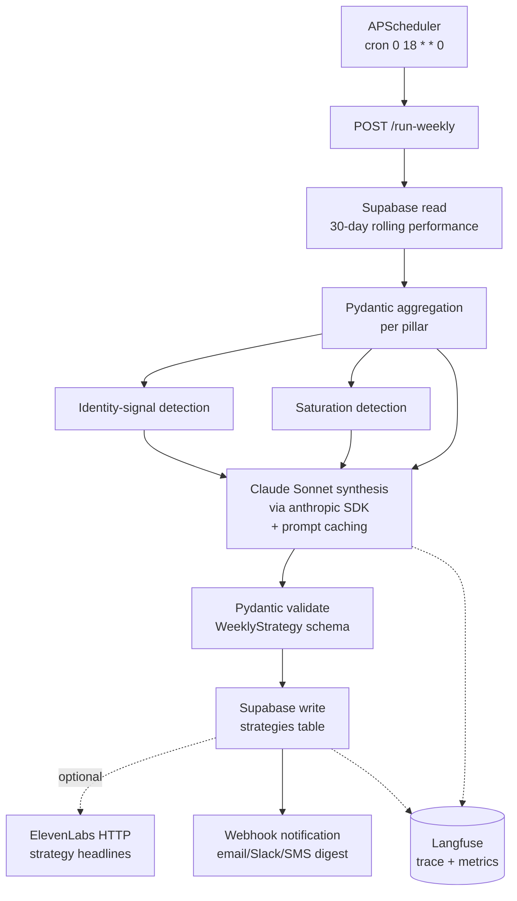
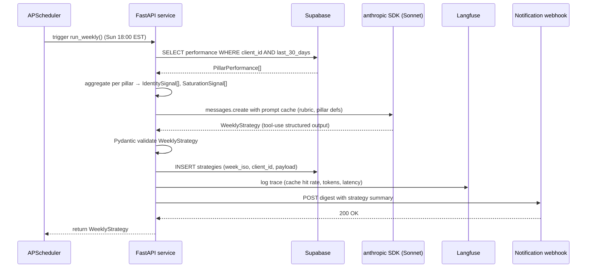

# Python Architecture — Marketing Team (Tier-3)

The complete build spec for the Self Learning Content Engine. Reference shapes only — actual Python is written when the build begins. Marketing Team is the **first true scheduled-cron agent in the Optimus stack** and the **agent-architecture reference pattern** every subsequent agent (including Tier-4 Autonomous Employees) inherits.

Cross-references:
- [`tech-stack-research.md`](tech-stack-research.md) — overview, why Claude is the LLM, ingestion options
- [`../shared-knowledge/agent-infrastructure.md`](../shared-knowledge/agent-infrastructure.md) — the four primitives this product is the first true use case for
- [`../../../anthony-rosa/portfolio-standards.md`](../../../anthony-rosa/portfolio-standards.md) — repo structure (DJ logo pipeline = engineering-hygiene reference)
- [`../../../anthony-rosa/north-star.md`](../../../anthony-rosa/north-star.md) — Drink-Own-Champagne 2027-Q3 milestone runs through this product

---

## Architecture diagram (Mermaid source)



Render to `/docs/architecture.png` in the future `optimus-marketing-team` repo.

---

## Sequence diagram for the weekly run



---

## Pydantic schemas

```python
from datetime import date, datetime
from typing import Literal, Optional
from pydantic import BaseModel, Field

class PillarPerformance(BaseModel):
    """Per-pillar metrics over the 30-day rolling window."""
    client_id: str
    pillar_name: str
    window_start: date
    window_end: date
    posts_count: int
    avg_reach: float
    avg_saves: float
    avg_shares: float
    avg_comments: float
    follower_delta: int
    completion_rate: float  # 0.0–1.0, for video pillars
    ctr_trend_4w: float  # week-over-week CTR change, smoothed

class IdentitySignal(BaseModel):
    """Detected shift in audience identity engagement."""
    client_id: str
    detected_at: datetime
    pillar_name: str
    signal_type: Literal["emerging_audience", "deepening_engagement", "fading_resonance"]
    evidence: str  # human-readable rationale
    confidence: float

class SaturationSignal(BaseModel):
    """Detected pillar saturation — the audience has had enough of this content shape."""
    client_id: str
    detected_at: datetime
    pillar_name: str
    saturation_metric: float  # 0.0–1.0, severity
    weeks_declining: int
    recommended_action: Literal["pause", "rotate_subtopic", "refresh_format", "deprecate"]

class WeeklyStrategy(BaseModel):
    """The generated strategy output for the upcoming week."""
    client_id: str
    week_iso: str  # e.g. "2026-W18"
    generated_at: datetime
    pillar_allocations: dict[str, float]  # pillar_name → fraction of week's posts
    suggested_hooks: list[dict]  # ordered list: {pillar, hook_concept, format, rationale}
    identity_signals_acted_on: list[str]  # IDs of IdentitySignal records
    saturation_signals_acted_on: list[str]  # IDs of SaturationSignal records
    rubric_score: float  # self-graded against the strategy quality rubric
    cache_hit_rate: float  # for observability
```

---

## FastAPI endpoint signatures

```python
from fastapi import APIRouter, Depends, HTTPException
router = APIRouter(prefix="/marketing")

@router.post("/run-weekly", response_model=WeeklyStrategy)
async def run_weekly(client_id: str = Depends(verify_client_token)) -> WeeklyStrategy:
    """
    Manual trigger / cron entry point. APScheduler calls this internally
    via cron `0 18 * * 0`. Idempotent per (client_id, week_iso) — re-running
    in the same week returns the existing strategy unless ?force=true is set.
    """

@router.get("/strategy/{week_iso}")
async def get_strategy(week_iso: str, client_id: str = Depends(verify_client_token)) -> WeeklyStrategy:
    """Retrieve a generated strategy by ISO week."""

@router.post("/ingest/performance")
async def ingest_performance(records: list[PillarPerformance], client_id: str = Depends(verify_client_token)):
    """
    Push performance data into the 30-day rolling table. Called by the
    upstream ingestion path (Phyllo aggregator or per-platform native API).
    """

@router.get("/pillars/{client_id}")
async def get_pillars(client_id: str = Depends(verify_client_token)):
    """Return current pillar configuration."""

@router.put("/pillars/{client_id}")
async def update_pillars(client_id: str, pillars: list[dict], _admin = Depends(verify_admin_token)):
    """Admin only — update pillar configuration."""
```

---

## Integration with the four agent-infrastructure primitives

Marketing Team is the first true use case for all four. Per [`../shared-knowledge/agent-infrastructure.md`](../shared-knowledge/agent-infrastructure.md):

### Memory store
- **Episodic:** every weekly run is logged. Inputs (`PillarPerformance`), outputs (`WeeklyStrategy`), tool calls (Supabase reads, anthropic call, ElevenLabs call) all stored as `EpisodicMemory` records.
- **Semantic:** pillar saturation patterns over 90 days. Identity-signal patterns. The aggregate "what does this client's audience respond to" learned over time.
- **Procedural:** "When a saturation signal hits 0.7+, rotate the affected pillar to a fresh subtopic" — encoded as a `ProceduralPattern` and re-applied weekly.

### Tool registry
- **Supabase read** (read-only, no rate limit, no approval) — performance ingestion
- **Supabase write strategies** (action-taking, approval not required because it's writing to Optimus-controlled storage, not external)
- **anthropic API call** (read-only effectively, rate-limited per Anthropic tier)
- **ElevenLabs voiceover** (action-taking, rate-limited per client per week, no approval)
- **Notification webhook** (action-taking, rate-limited per client per week, no approval — sending the digest is desired behavior)

### Observability layer
- Every run produces a Langfuse trace with: anthropic call inputs/outputs, cache hit rate, tokens (cached vs. non-cached), latency P50/P95, rubric score self-grading, success/failure.
- Mandatory metrics: cache hit rate per Anthropic call, strategy rubric score per week, saturation-signal precision (validated against next-week performance retrospectively).

### Approval / sandboxing layer
- v1 (strategy-only): no approval gates needed. Strategy outputs go to Supabase; humans read them when convenient.
- v2 (direct posting, later expansion): every post is approval-gated indefinitely (sending publicly to social is one of the always-approval-gated actions per the agent-infrastructure spec).

---

## Engineering-hygiene pattern (the DJ Custom Clothing reference)

Per [`../../../anthony-rosa/portfolio-standards.md`](../../../anthony-rosa/portfolio-standards.md), this build inherits the structural discipline DJ pipeline established:

- Public GitHub repo: `optimus-marketing-team`
- README with business problem, architecture, stack, setup, example I/O
- `/docs/architecture.png` (the Mermaid above, rendered)
- `/docs/agent-shape.md` documenting all four primitives (this product fills in concrete content for every primitive — it's the first agent that does)
- FastAPI auto-docs at `/docs`
- `/docs/retro.md` written after the first paying client
- Conventional commits throughout

Marketing Team is the first build where the engineering hygiene pattern AND the agent architecture pattern are both fully exercised. Subsequent agents (Voice Receptionist, Tier-4) inherit both patterns.

---

## Status

**Scoped, build in progress.** First scheduled-cron agent in the stack. The Drink-Own-Champagne 2027-Q3 milestone runs through Optimus's own dogfood instance of this product first — meaning the Optimus instance must be production-hardened by 2027-Q3 before it ships to paying Tier-3 clients.

Optimus dogfood instance tracking: [`../../../Optimus Inc/ai-agents/marketing-team/README.md`](../../../Optimus%20Inc/ai-agents/marketing-team/README.md).

#offering/content-engine #status/active
