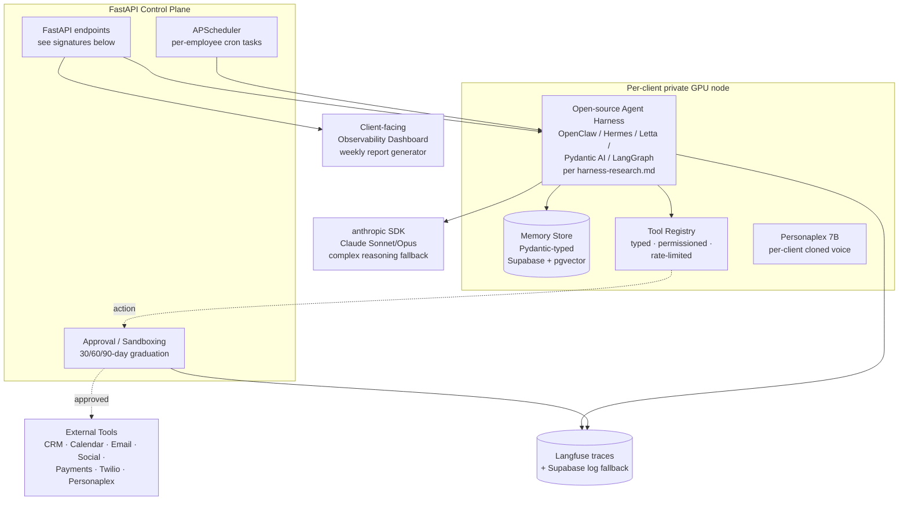

# Python Architecture — Tier-4 Autonomous AI Employee

The complete Tier-4 build spec. Reference shapes only — actual Python is written when the dogfood instance build begins (planned 2027-H1, ahead of the 2027-Q3 Drink-Own-Champagne milestone).

Tier-4 is built on Python from day one — same canonical Optimus stack as the lower three tiers, plus an open-source agent harness on top, plus per-client private GPU deployment.

Cross-references:
- [`README.md`](README.md) — product positioning, pricing, what the customer gets
- [`harness-research.md`](harness-research.md) — open-source harness comparison + first-build selection
- [`../shared-knowledge/agent-infrastructure.md`](../shared-knowledge/agent-infrastructure.md) — the four primitives Tier-4 inherits and extends
- [`../03 Marketing Team/python-architecture.md`](../03%20Marketing%20Team/python-architecture.md) — the prerequisite template every Tier-4 build inherits
- [`../../../anthony-rosa/north-star.md`](../../../anthony-rosa/north-star.md) — End Goal · Drink-Own-Champagne 2027-Q3 milestone · 4-point moat · Akash thesis

---

## Architecture diagram (Mermaid source)



Render to `/docs/architecture.png` in each per-client `optimus-employee-[client-slug]` repo.

---

## Pydantic schemas

```python
from datetime import datetime
from typing import Literal, Optional
from pydantic import BaseModel, Field

class EmployeeIdentity(BaseModel):
    """The persona/role definition. One per Tier-4 deployment."""
    employee_id: str
    client_id: str
    name: str  # the employee's name, e.g. "Sarah" — used in voice persona, signatures
    role: str  # "Office Manager" / "Sales Coordinator" / "Operations Lead" / etc.
    role_description: str  # 2–3 sentence description of what this employee does
    voice_persona_id: str  # links to Personaplex cloned voice if voice channel enabled
    deployed_at: datetime
    harness_name: str  # which open-source harness this employee runs on
    harness_version: str

class EmployeeMemory(BaseModel):
    """Tier-4 extends the agent-infrastructure memory primitive with employee-specific context."""
    employee_id: str
    memory_type: Literal["episodic", "semantic", "procedural", "relationship"]
    # 'relationship' is Tier-4-specific: facts about specific customers/contacts
    # the employee has interacted with, indexed for fast lookup during conversations
    payload: dict
    timestamp: datetime
    last_referenced: Optional[datetime] = None  # for memory consolidation/pruning
    embedding: Optional[list[float]] = None

class ToolPermission(BaseModel):
    """Per-employee tool permissions. Extends the agent-infrastructure tool registry."""
    employee_id: str
    tool_name: str
    permission_state: Literal["disabled", "approval_required", "graduated"]
    graduation_eligible_after: datetime  # 30 days post-deployment minimum
    approval_rate_30d: Optional[float] = None  # populated after 30 days of data
    rate_limit_per_hour: Optional[int] = None
    rate_limit_per_day: Optional[int] = None

class ApprovalRequest(BaseModel):
    """Pre-action gate per agent-infrastructure § 4."""
    request_id: str
    employee_id: str
    client_id: str
    proposed_action: dict  # {tool_name, inputs}
    rationale: str  # employee's reasoning
    requested_at: datetime
    deadline: Optional[datetime] = None  # for time-sensitive actions
    decision: Optional[Literal["approve", "deny", "modify"]] = None
    decided_by: Optional[str] = None
    decided_at: Optional[datetime] = None

class AgentAction(BaseModel):
    """A completed action — successful tool call, executed."""
    action_id: str
    employee_id: str
    client_id: str
    tool_name: str
    inputs: dict
    outputs: Optional[dict]
    status: Literal["success", "failure", "partial"]
    approval_request_id: Optional[str] = None  # if this action went through approval
    executed_at: datetime
    latency_ms: int
    cost_usd: Optional[float] = None  # LLM tokens + tool fees if applicable

class WeeklyReport(BaseModel):
    """Customer-facing observability report — generated automatically every Monday."""
    employee_id: str
    client_id: str
    week_iso: str
    actions_completed: int
    actions_approved: int
    actions_denied: int
    actions_pending: int
    tools_used: list[str]
    notable_events: list[str]  # 1–3 sentence highlights
    graduation_changes: list[dict]  # which tools graduated this week, if any
    cost_summary_usd: float
    next_week_outlook: str  # employee's own summary of what it expects next week
```

---

## FastAPI control-plane endpoint signatures

```python
from fastapi import APIRouter, Depends
router = APIRouter(prefix="/employee")

@router.post("/{employee_id}/run-cycle")
async def run_cycle(employee_id: str, _admin = Depends(verify_admin_token)):
    """
    Trigger the employee's reasoning loop. Called by APScheduler for periodic
    cycles, by external webhooks for event-driven cycles, or manually for
    debug/test. The harness handles the actual loop; this endpoint is the
    control-plane entry point.
    """

@router.post("/{employee_id}/approve-action/{action_id}")
async def approve_action(
    employee_id: str,
    action_id: str,
    decision: Literal["approve", "deny", "modify"],
    modification: Optional[dict] = None,
    rationale: Optional[str] = None,
    _user = Depends(verify_client_token),
):
    """Client-facing endpoint. The client (or Anthony, during onboarding)
    reviews pending ApprovalRequests and decides."""

@router.get("/{employee_id}/observability")
async def get_observability(
    employee_id: str,
    range_start: datetime,
    range_end: datetime,
    _user = Depends(verify_client_token),
):
    """Returns the AgentAction log + ApprovalRequest log + cost summary
    for the requested range. Powers the client-facing dashboard."""

@router.post("/{employee_id}/promote-tool")
async def promote_tool(
    employee_id: str,
    tool_name: str,
    _admin = Depends(verify_admin_token),
):
    """Graduate a tool from approval-required to autonomous. Requires
    ≥98% approval-granted rate over the prior 30 days. Manual flip by
    a human (Anthony or the client's authorized admin)."""

@router.get("/{employee_id}/weekly-report/{week_iso}", response_model=WeeklyReport)
async def get_weekly_report(employee_id: str, week_iso: str, _user = Depends(verify_client_token)):
    """The auto-generated weekly observability report."""
```

---

## Integration with the four agent-infrastructure primitives

Tier-4 IS these primitives — extended with the harness on top. Per [`../shared-knowledge/agent-infrastructure.md`](../shared-knowledge/agent-infrastructure.md):

### Memory store
Extends with the `relationship` memory type — specific facts about specific people the employee interacts with, indexed for fast recall during conversations. ("Last time Mike called he asked about emergency rates, ended up booking Tuesday.") Otherwise inherits episodic/semantic/procedural unchanged.

### Tool registry
Extends with `ToolPermission` per employee — every tool starts in `approval_required` state for 30 days, graduates per the 30/60/90 schedule. The same tool can be `graduated` for one employee and `approval_required` for another (different clients, different risk tolerances).

### Observability layer
Extends with the `WeeklyReport` auto-generator — every Monday, a Pydantic-validated report is generated from the prior week's `AgentAction` records and pushed to the client's chosen notification channel + stored in Supabase for the client dashboard.

### Approval / sandboxing layer
Tier-4 is the primary use case. The 30/60/90 graduation schedule defined in `agent-infrastructure.md` § 4 is implemented here. High-stakes actions (external emails, CRM closed-won/lost, public posting, payment APIs, deletions) **never graduate** — they stay approval-gated indefinitely.

---

## Marketing Team module — pre-loaded baseline

Every Tier-4 build inherits Marketing Team's content-strategy module as its default tool/memory baseline. Specifically:
- `PillarPerformance`, `WeeklyStrategy`, `IdentitySignal`, `SaturationSignal` schemas are available to the employee from day one
- The `run_weekly()` endpoint is wired to the employee's APScheduler with the same Sunday 18:00 EST cron
- The employee can call Marketing Team's pillar-analysis tools as part of its own reasoning loop

This means a Tier-4 employee starts with a working content-strategy capability the moment it's deployed, even before any client-specific tools are added. The employee then expands its surface area via custom-trained tools per client.

---

## Deployment options — private per-client GPU compute

Tier-4 is the primary case for private per-client GPU deployment. Three paths supported:

### Option 1 — Self-hosted on owned GPU (early Tier-4 clients)

- Optimus owns a small fleet of A100/H100 cards; rents capacity to early Tier-4 clients while harness selection and operational practices are being shaken out.
- Pros: full control, fast iteration, deep ops learning during the dogfood + first-paying-client phase.
- Cons: Optimus carries the GPU capex + ops burden directly. Doesn't scale beyond ~5 clients.

### Option 2 — Cloud GPUs (AWS / GCP / Lambda Labs / RunPod) (mid-stage)

- Per-client containerized deployment on commodity GPU cloud.
- Pros: scales beyond owned-GPU capacity. Standard cloud ops practices.
- Cons: per-client cost compounds. Centralized provider dependency.

### Option 3 — **Akash Network** — long-term destination

- **Decentralized GPU marketplace.** Per-client GPU lease via Akash Console / AkashML. Personaplex Docker container + harness Docker container deploy directly. Aligned with the End Goal in [`../../../anthony-rosa/north-star.md`](../../../anthony-rosa/north-star.md) § The End Goal.
- **Why this is the destination, not the starting line:**
  - **Private per-client compute** — their data, their model, their compute. Not multi-tenant SaaS. Structural moat per `north-star.md` § The Moat.
  - **No centralized rate-limit dependency** — clients running on Akash are not subject to OpenAI / Anthropic API rate limits, content policies, or pricing changes outside Optimus's control.
  - **Decentralized, censorship-resistant, cost-effective at scale** — as the Tier-4 client fleet grows past Option 2's economics.
  - **Direct alignment with Greg Osuri's thesis** — Akash is the infrastructure layer Optimus operates from at scale. By 2029, every paying Tier-4 client deployed on Akash is part of the case study that earns Greg's attention.
- **Path:** Operational maturity catches up over Year 1–2; first Tier-4 paying clients deploy via Option 1 or 2 while Akash deployment expertise is being built (initially via Voice Receptionist's Personaplex deployments per [`../02 Voice Receptionist/personaplex-architecture.md`](../02%20Voice%20Receptionist/personaplex-architecture.md) § Deployment). Year 3 forward, Akash is the default deployment target for new Tier-4 clients.

---

## Cost model per client

Rough math for a typical Tier-4 client at $3,500/mo MRR mid-tier price:

| Cost | Range | Notes |
|---|---|---|
| **Compute (GPU)** | $400–1,200/mo | Varies by deployment option and utilization |
| **anthropic API calls** | $200–600/mo | Cached aggressively; Sonnet for routine, Opus for high-stakes reasoning |
| **Twilio (voice + SMS)** | $50–200/mo | Per-client traffic-dependent |
| **Supabase + pgvector** | $25–100/mo | Memory store + observability log volume |
| **Langfuse** | $50–100/mo | Trace UI + analytics |
| **Total cost of goods** | $725–2,200/mo | |
| **Gross margin at $3,500 MRR** | **37–79%** | Acceptable on the low end (early operational learning); strong on the high end |

At the $5,000+ MRR mid-tier price point, gross margin is consistently >70% even on early-build inefficiencies.

---

## Status

**Scoped. First implementation begins at the dogfood instance build (planned 2027-H1).** Optimus's own Tier-4 instance ships by 2027-Q3 Drink-Own-Champagne milestone per [`../../../anthony-rosa/north-star.md`](../../../anthony-rosa/north-star.md) § The Drink-Own-Champagne Milestone. First paying Tier-4 client target: **Year 3 (2028–2029)**.

Optimus dogfood instance tracking: [`../../../Optimus Inc/ai-agents/autonomous-employee/README.md`](../../../Optimus%20Inc/ai-agents/autonomous-employee/README.md).

#offering/autonomous-employee #status/in-development
